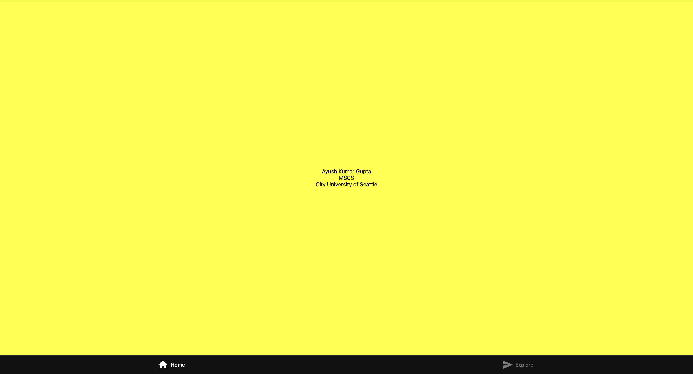

# Hello World

## Input
The program does not require dynamic user input. Instead, the input is hardcoded directly within the app’s source code. This includes three text values: the developer's name, the degree program, and the school name. These inputs represent static content that the application displays when it runs.

## Process
Upon launching the application, the single App function is executed. This function uses one View component as a container, which applies styling defined in the StyleSheet object. The three Text components inside the View are used to display the hardcoded input values. The StyleSheet applies a yellow background to the container and centers the text using Flexbox layout properties.

## Output
The application displays a centered, yellow screen containing three lines of text: the developer’s name, degree program, and school. This fulfills both the user and system requirements using exactly five React Native components and ensures clarity, simplicity, and readability on mobile and web platforms.


## Get started
This is an [Expo](https://expo.dev) project created with [`create-expo-app`](https://www.npmjs.com/package/create-expo-app).

1. Install dependencies

   ```bash
   npm install
   ```

2. Start the app

   ```bash
    npx expo start
   ```

In the output, you'll find options to open the app in a

- [development build](https://docs.expo.dev/develop/development-builds/introduction/)
- [Android emulator](https://docs.expo.dev/workflow/android-studio-emulator/)
- [iOS simulator](https://docs.expo.dev/workflow/ios-simulator/)
- [Expo Go](https://expo.dev/go), a limited sandbox for trying out app development with Expo

## Author
- Name: Ayush Kumar Gupta
- Email: guptaayushkumar@cityuniversity.edu