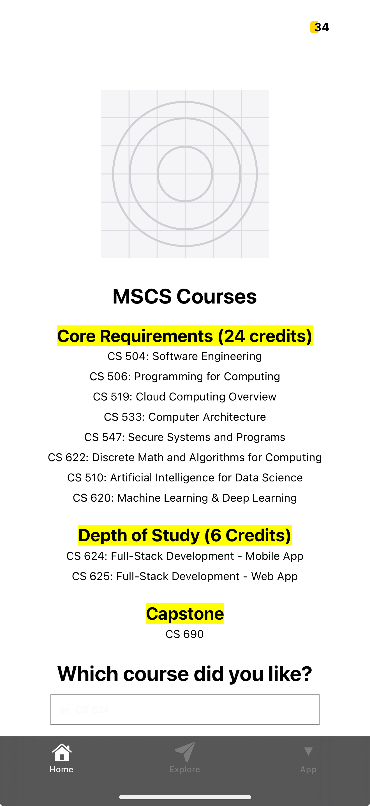

# Hello World

# Input  
The application collects input in two forms. First, it uses hardcoded course names for the 8 core courses, 2 depth of study courses, and 1 capstone course. Second, it accepts user input through a `TextInput` field that lets users enter their favorite course.

# Process  
The app is built using an arrow function component with core React Native components: `View`, `Text`, `ScrollView`, `Image`, `TextInput`, and `StyleSheet`. All courses are displayed using a scrollable layout. The favorite course input is tracked using React's `useState` hook. Styling is handled internally using a single `StyleSheet` object to control layout, spacing, fonts, and image display.

# Output  
The output is a scrollable screen showing an image (icon.png), a categorized list of MSCS courses, and the user’s inputted favorite course, which is displayed after entry. The screen is clean, structured, and mobile-friendly, demonstrating the use of React Native core components effectively.



## Get started
This is an [Expo](https://expo.dev) project created with [`create-expo-app`](https://www.npmjs.com/package/create-expo-app).

1. Install dependencies

   ```bash
   npm install
   ```

2. Start the app

   ```bash
    npx expo start
   ```

In the output, you'll find options to open the app in a

- [development build](https://docs.expo.dev/develop/development-builds/introduction/)
- [Android emulator](https://docs.expo.dev/workflow/android-studio-emulator/)
- [iOS simulator](https://docs.expo.dev/workflow/ios-simulator/)
- [Expo Go](https://expo.dev/go), a limited sandbox for trying out app development with Expo

## Author
- Name: Ayush Kumar Gupta
- Email: guptaayushkumar@cityuniversity.edu