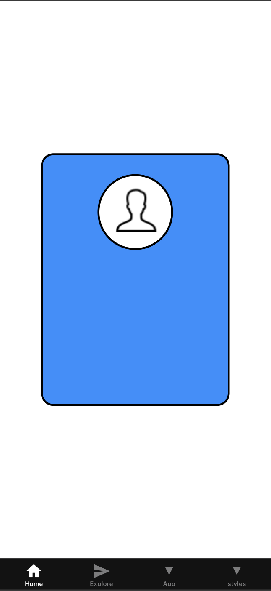
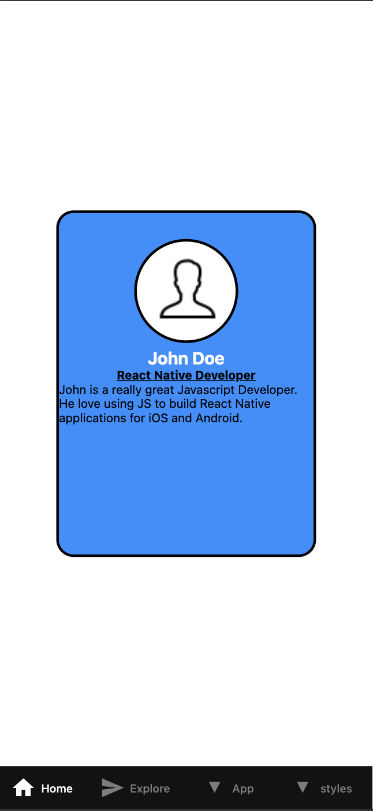

# Input
The program begins by copying an existing React Native project from previous exercises (HOS05 and HOS06) into separate folders for Part 1 and Part 2. The input includes user profile details such as name, occupation, and a brief description for each profile card. Additionally, layout configurations and styling properties from the textbook (Dabit, 2019) are used as inputs for building and styling components.

# Process
In Part 1, the Profile Card component is enhanced using text styling techniques learned from Chapter 4 of the textbook. The user interface is customized to display a single card with styled text components.

# Output
The final output is a mobile application with an improved and styled Profile Card in Part 1.




## Get started
This is an [Expo](https://expo.dev) project created with [`create-expo-app`](https://www.npmjs.com/package/create-expo-app).

1. Install dependencies

   ```bash
   npm install
   ```

2. Start the app

   ```bash
    npx expo start
   ```

In the output, you'll find options to open the app in a

- [development build](https://docs.expo.dev/develop/development-builds/introduction/)
- [Android emulator](https://docs.expo.dev/workflow/android-studio-emulator/)
- [iOS simulator](https://docs.expo.dev/workflow/ios-simulator/)
- [Expo Go](https://expo.dev/go), a limited sandbox for trying out app development with Expo

## Author
- Name: Ayush Kumar Gupta
- Email: guptaayushkumar@cityuniversity.edu